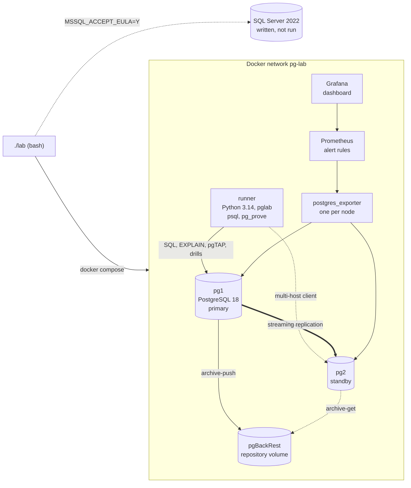

# pg-lab

A PostgreSQL 18 performance and reliability lab on the real schema of
[TopFlow Hub](https://github.com/fasharif/topflow), run end to end by one script.

[](https://github.com/fasharif/pg-lab/actions/workflows/ci.yml)


*The provisioned Grafana dashboard during `./lab load` (pgbench) on a laptop shared with other
builds. It shows the monitoring working; its throughput and latency values are not benchmarks.*

## Results at ten million order lines

One measured run of the whole lab at SCALE=10000000 (ten million order lines) on a laptop,
through Docker Desktop; no other workload ran during any timed step (docs/benchmarking.md). The
tables below are copied from the committed reports by `./lab readme`; each report states the
command that produced it, the data, the server and the environment.

<!-- pglab:environment -->
Environment of these runs, as every report records it: Docker Desktop (Docker 29.8.1), 16 CPUs and 7.4 GiB of memory for all containers on Windows 11 build 26200 (Git Bash); memory limits pg1 3g, pg2 3g, runner 512m; shared_buffers 1GB, effective_cache_size 2GB, maintenance_work_mem 512MB, work_mem 16MB; ASUS TUF Gaming A15 FA507RC laptop (AMD Ryzen 7 6800H, 8 cores and 16 threads; 16 GB of RAM; Intel SSDPEKNU512GZ 512 GB NVMe SSD) on mains power with the Performance power plan, through Docker Desktop's WSL 2 virtual machine; what else ran on the machine during the measured run is recorded in docs/benchmarking.md.
<!-- /pglab:environment -->

### The casebook: the slowest statements, before and after their fixes

<!-- pglab:casebook -->
The summary of [reports/casebook.md](reports/casebook.md), written by `./lab casebook --measure` on 2026-10-02 17:41 UTC at SCALE=10000000 (about 10,000,000 order lines). Buffers are the 8 kB pages a statement read, before and after its fix. Times: median of 15 runs after one warm-up run; server-side planning plus execution time, including converting the rows to text, from EXPLAIN (ANALYZE, SERIALIZE TEXT, TIMING OFF, SUMMARY ON); sending them to the client is not included.

| # | Statement (from the TopFlow API) | Fix | Buffers before | Buffers after | Median before | Median after |
| ---: | --- | --- | ---: | ---: | ---: | ---: |
| 1 | [Audit trail filtered by action prefix, number of entries](reports/casebook.md#case-01) | B-tree index with `text_pattern_ops` for prefix `LIKE` | 336,188 | 103 | 1,159 ms | 9.1 ms |
| 2 | [Audit trail of one user, number of entries](reports/casebook.md#case-02) | Composite B-tree index (the one added in case 3) | 336,188 | 14 | 1,035 ms | 0.048 ms |
| 3 | [Audit trail of one user (first page)](reports/casebook.md#case-03) | Composite B-tree index `(userId, createdAt)` | 186,024 | 24 | 782 ms | 0.062 ms |
| 4 | [Back-office order search (order, PO or project number, customer or company name)](reports/casebook.md#case-04) | `pg_trgm` GIN indexes and a rewrite of the OR across relations into a UNION | 116,381 | 2,084 | 1,059 ms | 23.4 ms |
| 4 | [Back-office order search, number of matches (pagination total)](reports/casebook.md#case-04-total) | same fix as the page, rewritten to count the matches | 116,367 | 1,589 | 1,050 ms | 22.4 ms |
| 5 | [Dashboard: the eight most recent orders](reports/casebook.md#case-05) | B-tree index on `createdAt` (the covering index added in case 7) | 107,816 | 4 | 729 ms | 0.057 ms |
| 6 | [Dashboard: orders placed in the last 30 days](reports/casebook.md#case-06) | B-tree index on `createdAt` (the covering index added in case 7) | 107,742 | 409 | 303 ms | 5.8 ms |
| 7 | [Dashboard: revenue of the last 30 days](reports/casebook.md#case-07) | Covering B-tree index: `createdAt` with `INCLUDE (status, totalAmount)` | 107,742 | 409 | 306 ms | 9.6 ms |
| 8 | [Order history of an organisation (trade portal, first page)](reports/casebook.md#case-08) | Composite B-tree index `(organizationId, createdAt)`, `INCLUDE (userId)` | 34,023 | 22 | 66.6 ms | 0.106 ms |
| 9 | [Category tree with visible product counts](reports/casebook.md#case-09) | Partial B-tree index on visible products | 50,065 | 114 | 36.4 ms | 1.9 ms |
| 10 | [Back-office quotations in one status (SENT, awaiting the customer)](reports/casebook.md#case-10) | Composite B-tree index `(status, updatedAt)` replacing the single-column one | 49,826 | 7 | 67.6 ms | 0.066 ms |
| 11 | [Sales search over quote requests (number, project, company, contact)](reports/casebook.md#case-11) | One multicolumn `pg_trgm` GIN index over five columns and a UNION rewrite, with case 4's index on organisation names | 46,464 | 1,046 | 572 ms | 9.4 ms |
| 11 | [Sales search over quote requests, number of matches (pagination total)](reports/casebook.md#case-11-total) | same fix as the page, rewritten to count the matches | 46,450 | 650 | 559 ms | 8.8 ms |
<!-- /pglab:casebook -->

### The drills: recovery time, data loss and write downtime

<!-- pglab:drills -->
From the drill reports, at SCALE=10000000 (about 10,000,000 order lines); every value is from one run of the drill (`./lab pitr-drill --target time --measure`, `./lab pitr-drill --target name --measure`, `./lab switchover --measure`, `./lab failover-drill --measure`).

| Drill | Measure | Value | Checks passed |
| --- | --- | ---: | ---: |
| [PITR, to the time recorded before the accident](reports/pitr-drill.md) | Recovery time (RTO): damaged primary stopped until the restored one accepts writes | 53.74 s | 6 of 6 |
| [PITR, to the time recorded before the accident](reports/pitr-drill.md) | Data lost (RPO of an in-place restore): from the target to the last acknowledged write that the restore discarded | 36.80 s | 6 of 6 |
| [PITR, to the time recorded before the accident](reports/pitr-drill.md) | Recovery reached the target: target minus the last write it kept | 0.03 s | 6 of 6 |
| [PITR, to a restore point](reports/pitr-drill-name.md) | Recovery time (RTO): damaged primary stopped until the restored one accepts writes | 63.90 s | 6 of 6 |
| [PITR, to a restore point](reports/pitr-drill-name.md) | Data lost (RPO of an in-place restore): from the target to the last acknowledged write that the restore discarded | 67.74 s | 6 of 6 |
| [PITR, to a restore point](reports/pitr-drill-name.md) | Recovery reached the target: target minus the last write it kept | 0.07 s | 6 of 6 |
| [Planned switchover, pg1 to pg2](reports/switchover-drill-pg1-to-pg2.md) | Write downtime seen by the client: longest gap between acknowledged writes | 4.42 s | 6 of 6 |
| [Planned switchover, pg1 to pg2](reports/switchover-drill-pg1-to-pg2.md) | Switchover script: old primary stopped until the new one was promoted | 2.63 s | 6 of 6 |
| [Planned switchover, pg1 to pg2](reports/switchover-drill-pg1-to-pg2.md) | Reconnection: the client's first write on the new primary, from sending it to its acknowledgement | 4.02 s | 6 of 6 |
| [Planned switchover, pg2 to pg1](reports/switchover-drill-pg2-to-pg1.md) | Write downtime seen by the client: longest gap between acknowledged writes | 6.32 s | 6 of 6 |
| [Planned switchover, pg2 to pg1](reports/switchover-drill-pg2-to-pg1.md) | Switchover script: old primary stopped until the new one was promoted | 2.38 s | 6 of 6 |
| [Planned switchover, pg2 to pg1](reports/switchover-drill-pg2-to-pg1.md) | Reconnection: the client's first write on the new primary, from sending it to its acknowledgement | 4.01 s | 6 of 6 |
| [Unplanned failover (primary killed)](reports/failover-drill.md) | Write downtime seen by the client: longest gap between acknowledged writes | 4.31 s | 8 of 8 |
| [Unplanned failover (primary killed)](reports/failover-drill.md) | Old primary killed (Docker's record) until the promotion finished (server clock) | 0.97 s | 8 of 8 |
| [Unplanned failover (primary killed)](reports/failover-drill.md) | Of which the promotion itself: `pg_promote()` on the new primary (server clock) | 0.10 s | 8 of 8 |
| [Unplanned failover (primary killed)](reports/failover-drill.md) | Reconnection: the client's first write on the new primary, from sending it to its acknowledgement | 4.01 s | 8 of 8 |
<!-- /pglab:drills -->

In the switchovers and the failover, about 4 s of the downtime is the client's reconnection,
not the database: libpq first looks up the name of the node that is down, and Docker's DNS takes
seconds to answer (docs/replication.md). The failover drill promotes the standby the moment it
kills the primary, so a real failover's detection time comes on top.

These are one laptop's numbers from one run, not a benchmark of PostgreSQL: Docker Desktop runs
the containers in a virtual machine with 7.4 GiB of memory, and each node is limited to 3 GB with
1 GB of shared buffers. The drills ran once each. docs/benchmarking.md describes the run and how
to repeat it.

## The problem

TopFlow Hub is Farah Sharif's portfolio commerce platform for an irrigation supplier in the UAE
(built with Top Flow's permission; it is not Top Flow's official system). Its database was
designed for correctness: Prisma migrations, foreign keys everywhere, row-level security switched
on. This lab asks what happens next, with data at the scale a growing business would reach:

- Which of the API's queries become slow, and what fixes them without breaking something else?
- What does each index cost on writes?
- Would partitioning help, and what would it break?
- After someone runs `DELETE` without `WHERE`, can the database go back to the moment before, and
  how do we know nothing was lost?
- Can the primary be replaced without the application noticing more than a short pause?
- Can one customer ever read another customer's orders?
- Would anyone notice if replication fell behind or WAL archiving failed?

Each answer is a script that anyone can rerun, and each report says how it was produced.

## Features

- **Real schema.** TopFlow Hub's four Prisma migrations, copied unchanged and hash-checked.
- **Data generator.** Pure SQL with a SCALE parameter (order lines): about 100,000 in CI,
  10 million as the documented target; the generator accepts up to 100 million, and 50 million
  is an option not yet run. Deterministic, skewed like real customers, order totals consistent
  with their lines; `./lab seed` describes what it generated in
  [reports/dataset.md](reports/dataset.md) ([docs/data.md](docs/data.md)).
- **Workload.** 38 read statements taken from the TopFlow API's services, each linked to its
  source: each of the 14 paginated lists with the count it runs for its pager, the dashboard's
  and the catalogue's statements, and an order's lines. Ranked by the buffers they touch, and
  in a measured run by median time ([reports/workload.md](reports/workload.md)).
- **Performance casebook.** Eleven cases, each with its plan before and after, the fix
  (composite, covering, partial and trigram indexes, query rewrites, a redundant index dropped),
  machine-checked plan expectations and, for a rewrite, a check that it returns the same rows.
  Ten were chosen as the heaviest statements by shared buffers at SCALE=1000000; the measured
  ranking by median time at SCALE=10000000 added the RFQ search (case 11), and cases 8 to 10,
  which fell out of its top ten, stay. The order and RFQ searches' pagination counts are fixed
  and checked in the same case as their page ([reports/casebook.md](reports/casebook.md),
  [docs/benchmarking.md](docs/benchmarking.md)).
- **Indexing strategy.** What to index and what not, with measured index sizes and WAL per
  inserted row before and after ([docs/indexing.md](docs/indexing.md),
  [reports/indexing.md](reports/indexing.md)).
- **Partitioning.** Monthly range partitions of `orders` and `audit_logs`, pruning checked plan by
  plan (including run-time pruning of a generic plan), retention by `DETACH PARTITION
  CONCURRENTLY`, and a maintenance command that also finishes a detach an earlier run left
  half done ([docs/partitioning.md](docs/partitioning.md)).
- **Point-in-time recovery drill.** pgBackRest with WAL archiving; a scripted `DELETE` without
  `WHERE`, then a restore to the time recorded just before it (or to a named restore point),
  verified by row counts, a content checksum and every acknowledged client write, and a count of
  the writes an in-place restore loses ([docs/pitr.md](docs/pitr.md)).
- **Replication, switchover and failover drills.** A streaming standby; a planned switchover with
  a client that keeps writing and must lose nothing; an unplanned failover, where the primary is
  killed under a writing client and the standby promoted, then the old primary comes back
  without fencing and is rewound by pg_rewind, connected as a non-superuser role. Both measure
  the write downtime the client sees ([docs/replication.md](docs/replication.md)).
- **Security.** Five application roles and three infrastructure roles with least privilege
  (column-level `UPDATE` and state-checking policies for customer writes), SCRAM-only
  authentication, and row-level security for tenant isolation, tested by 96 pgTAP checks on
  every tenant table with generated tenants. The trust boundary is stated plainly: the policies
  stop queries that forget their tenant filter, not code that can run arbitrary SQL as the API
  role ([docs/security.md](docs/security.md)).
- **Monitoring.** postgres_exporter, Prometheus with eleven alert rules, each covered by a
  promtool scenario, and a provisioned Grafana dashboard
  ([docs/monitoring.md](docs/monitoring.md)).
- **SQL Server chapter.** The casebook on SQL Server 2022, written and syntax-checked but not run
  ([docs/sqlserver.md](docs/sqlserver.md)).

## Architecture



The two nodes are symmetric: after `./lab switchover`, pg2 is the primary and pg1 streams from
it. Every port is bound to 127.0.0.1 (55400 to 55499).

## Tech stack and why

| Part | Choice | Why |
| --- | --- | --- |
| Database | PostgreSQL 18.6 (official image) | current stable major; data checksums on by default |
| Backups | pgBackRest 2.59 (PGDG package; each PITR report records the exact version) | delta restore, built-in checks and retention, packaged by PGDG (ADR 8) |
| Tests in SQL | pgTAP 1.3 with pg_prove | privileges and tenant isolation are best tested where they are enforced |
| Tooling | Python 3.14, psycopg 3.3, uv | plan parsing, reports and drills; typed (mypy strict), linted (ruff), locked |
| Orchestration | bash and Docker Compose | the host needs Docker and bash only; the same commands run in CI |
| Monitoring | postgres_exporter 0.20, Prometheus 3.15, Grafana 13.2 | the usual open-source stack; rules tested with promtool |
| Checks | shellcheck, sqlfluff, actionlint | shell, SQL syntax and workflow linting |

Decisions and their trade-offs: [docs/decisions.md](docs/decisions.md).

## Quick start

Needs Docker with Compose v2 and bash (Git Bash on Windows). The containers' memory limits add
up to 1.5 GB for the primary and the tools container, and about 1.7 GB more with the standby
and monitoring.

```bash
git clone https://github.com/fasharif/pg-lab.git && cd pg-lab
./lab up          # creates .env with random passwords, builds, starts pg1, migrates
./lab seed        # 100,000 order lines (LAB_SCALE)
./lab casebook    # before/after plans with checks, reports/casebook.md
./lab ci          # everything: tests, partitions, PITR, switchover, monitoring
```

`./lab help` lists every command. `./lab down` stops the lab and deletes its volumes. The
commands write their reports into `reports/`, over the committed SCALE=10000000 versions;
`git restore reports` brings those back (`./lab ci` writes to `out/reports` instead).

## Configuration

`./lab init` (run by `./lab up`) copies `.env.example` to `.env` and replaces every `change-me`
with a random value. `.env` is ignored by git.

| Setting | Default | Meaning |
| --- | --- | --- |
| `LAB_SCALE` | 100000 | order lines generated by `./lab seed` (1000 to 100000000); a value set in the shell wins over `.env` |
| `LAB_PG_MEM_LIMIT`, `LAB_PG2_MEM_LIMIT`, `LAB_RUNNER_MEM_LIMIT` | 1g, 768m, 512m | container memory limits |
| `LAB_SHARED_BUFFERS`, `LAB_EFFECTIVE_CACHE_SIZE`, `LAB_MAINTENANCE_WORK_MEM`, `LAB_WORK_MEM` | 256MB, 768MB, 128MB, 8MB | server memory settings (see docs/benchmarking.md for 10M rows) |
| `LAB_PG1_PORT`, `LAB_PG2_PORT` | 55432, 55433 | PostgreSQL on 127.0.0.1 |
| `LAB_GRAFANA_PORT`, `LAB_PROMETHEUS_PORT` | 55430, 55490 | monitoring on 127.0.0.1 |
| `LAB_*_PASSWORD` | random | one password per role; Grafana's admin password |
| `LAB_MSSQL_*` | random, 55414, 3g | SQL Server chapter only |
| `LAB_PROJECT` | pg-lab | Compose project name, and the prefix of every container, volume and image |
| `LAB_ENVIRONMENT_NOTE` (shell) | none | extra text for the environment line of every report |

`./lab psql --user topflow_analyst` opens psql as any of the lab roles.

## Tests

| Command | What it runs |
| --- | --- |
| `./lab check` | ruff, mypy --strict, 109 unit tests (plans recorded from the lab, definitions, report rendering, drill analysis, the README's result tables against the reports, monitoring check, SQL Server parser), workload and casebook validation, sqlfluff syntax checks of `sql/lab`, `sql/security`, `sql/partitioning` and `sqlserver/sql` (not the generator, the pgTAP suites or the workload statements), promtool on the alert rules and their 10 scenarios, shellcheck |
| `./lab test` | 186 pgTAP tests (schema; roles, table and column privileges; tenant isolation and customer writes; SCRAM and pg_hba; partition functions, which need `./lab partition` first) and 22 integration tests (live logins, session defaults, the tenant queries keeping their indexes under RLS, the policy design, casebook indexes rebuilt when invalid or outdated, partition maintenance finishing an interrupted run) |
| `./lab casebook` | the plan checks of the eleven cases and of the pagination totals of cases 4 and 11, before and after, and the rewrites' result checks |
| `./lab ci` | the whole lab at LAB_SCALE: up, seed, workload, casebook, indexing, partitions and maintenance, tests, RLS plans, PITR drills (to a recorded time and to a restore point), replica, switchover and back, failover drill, tests again, monitoring with a 10-second pgbench load, monitoring check |

GitHub Actions runs the static checks and `./lab ci` on every push to `main` and every pull
request (`.github/workflows/ci.yml`).

## Folder structure

```text
lab                      entry point (bash)
compose.yaml             pg1, pg2, runner, exporters, Prometheus, Grafana
docker/                  node image (PostgreSQL, pgBackRest, pgTAP), runner, monitoring images
sql/topflow/             TopFlow Hub's migrations, unchanged (SOURCE.md has the hashes)
sql/lab/                 helper schema and the generator's model functions
sql/generate/            the data generator (psql script)
sql/security/            grants and row-level security policies
sql/partitioning/        partitioned tables and maintenance functions
workload/                the API's statements (queries.toml) and a pgbench script
casebook/                the eleven cases: fix, revert, expected plans, trade-offs
src/pglab/               Python tooling: plans, casebook, reports, drills, monitoring check
scripts/                 shared shell functions, migrations, drills, SQL Server commands
monitoring/              Prometheus configuration, alert rules and their tests, Grafana
sqlserver/               SQL Server 2022 chapter (written, not run)
tests/                   unit, integration and pgTAP tests; recorded fixtures
reports/                 generated reports (SCALE=10000000, one measured run)
docs/                    one page per chapter, decisions, benchmarking policy
```

## Design decisions

Sixteen short records in [docs/decisions.md](docs/decisions.md). The ones that shaped the lab most:
reports rank work by buffers and publish durations only from measured runs; CI checks plan shape,
not speed; the casebook is data, not code; row-level security tests tenant rows with a function
the planner cannot see into, because policies it can see into made it misjudge the tenant
queries' row counts ([reports/rls-plans.md](reports/rls-plans.md)), at the price of a function
call per row for a query that forgets its tenant filter; and the SQL Server chapter stops at the
licence decision.

## Limitations and roadmap

Not done yet, stated plainly:

- **One laptop, one run.** The timings come from a single run at SCALE=10000000 on a laptop
  through Docker Desktop, with each node limited to 3 GB; the drills ran once each. A server, a
  repeat run or SCALE=50000000 (accepted by the generator, never run) would give other numbers
  (docs/benchmarking.md).
- **The audit trail's exact count.** `audit-count`, the pager's count of all ten million audit
  entries, ranked 11th by time (275 ms), just outside the casebook's top ten; an estimated or
  capped count would be its fix.
- **Downtime set by the client's reconnection.** About 4 s of every measured switchover and
  failover is libpq looking up the stopped node's name in Docker's DNS; a proxy or fixed
  addresses would remove most of it, which is not measured (docs/replication.md).
- **Hand-written workload SQL.** The statements follow TopFlow's Prisma calls but were written by
  hand. Capturing what Prisma sends (`pg_stat_statements` while TopFlow's API tests run against
  the lab schema) would confirm them one by one.
- **PITR to the accident's own transaction.** The drill restores to a recorded time or a restore
  point; finding the `DELETE`'s transaction id with `pg_waldump` and restoring with
  `--type=xid --target-exclusive` is not scripted yet (docs/pitr.md).
- **Alerts tested with promtool only.** The monitoring check confirms that both nodes are scraped
  and the rules are loaded; no drill makes an alert fire on the running stack yet.
- **SQL Server not run.** It needs you to accept Microsoft's licence; the expected plans in
  `sqlserver/expectations.toml` are unconfirmed until then.
- **No automatic failover or fencing** (Patroni or similar) and no connection proxy. The failover
  drill promotes the standby the moment it kills the primary, so failure detection is not part of
  its downtime, and it shows what a failover without fencing loses. TopFlow's API client
  (node-postgres) is not covered by the libpq multi-host approach (docs/replication.md).
- **Self-asserted tenant context.** Row-level security trusts the user and organisation the API
  session sets; a verified token or a role per tenant would close that gap (docs/security.md).
- **CI not yet run on GitHub.** The workflow's commands were run locally from a fresh clone on
  Docker Desktop (an earlier version also in a Linux container with a GitHub-like runner user),
  but not on GitHub Actions.
- **No TLS** between clients and servers; SCRAM protects passwords only.
- **One pgBackRest repository on a local volume.** A second repository on object storage and
  scheduled differential backups would be the next step.
- **Text ids.** Converting TopFlow's UUID-as-text keys to `uuid` would roughly halve every id
  index (measured in docs/indexing.md); it is a migration of every table.

## Licence

MIT, copyright (c) 2026 Farah Sharif (see [LICENSE](LICENSE)). The TopFlow Hub migrations in
`sql/topflow/` are Farah Sharif's own work under the same licence (source in
[sql/topflow/SOURCE.md](sql/topflow/SOURCE.md)). All generated data is fictional.
