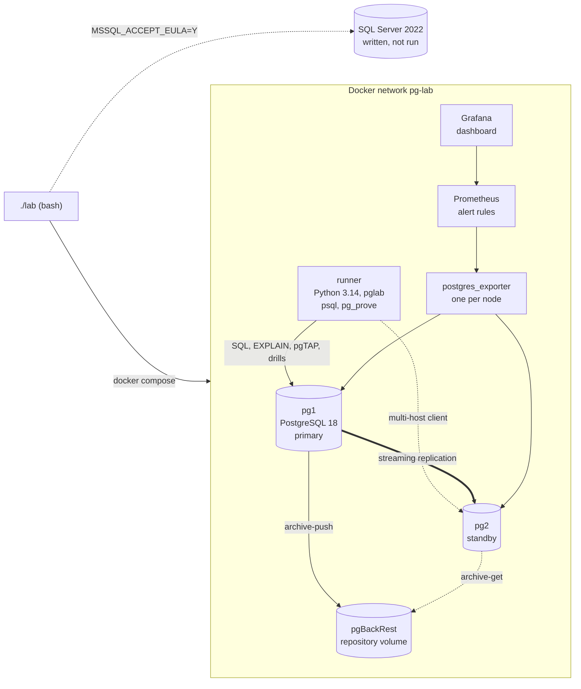

# pg-lab

A PostgreSQL 18 performance and reliability lab built on the real schema of TopFlow Hub: query
tuning with plan checks, partitioning, point-in-time recovery, switchover, row-level security and
monitoring, all run by one script.

[](https://github.com/fasharif/pg-lab/actions/workflows/ci.yml)


*The provisioned Grafana dashboard during `./lab load` (pgbench) on a laptop shared with other
builds. It shows the monitoring working; its throughput and latency values are not benchmarks.*

Sample output: the summary of `reports/casebook.md`, generated by `./lab casebook` at
SCALE=1000000 (one million order lines). Buffers are 8 kB pages read by each statement, before
and after its fix; every plan check also runs in CI.

| # | Statement (from the TopFlow API) | Fix | Buffers before | Buffers after |
| ---: | --- | --- | ---: | ---: |
| 1 | Audit trail by action prefix, count | B-tree with `text_pattern_ops` | 33,618 | 14 |
| 2 | Audit trail of one user, count | composite index of case 3 | 33,618 | 6 |
| 3 | Audit trail of one user, first page | `(userId, createdAt)` | 23,110 | 24 |
| 4 | Back-office order search | pg_trgm GIN indexes and a UNION rewrite | 11,640 | 758 |
| 5 | Dashboard: eight newest orders | covering index of case 7 | 10,842 | 4 |
| 6 | Dashboard: orders in the last 30 days | covering index of case 7 | 10,768 | 45 |
| 7 | Dashboard: revenue of the last 30 days | `createdAt INCLUDE (status, totalAmount)` | 10,768 | 45 |
| 8 | Order history of an organisation | `(organizationId, createdAt) INCLUDE (userId)` | 6,761 | 18 |
| 9 | Category tree with product counts | partial index on visible products | 5,081 | 84 |
| 10 | Quotations in one status | `(status, updatedAt)` replacing `(status)` | 4,977 | 7 |

Timings are **pending a measured run**: this machine was shared with other builds, so no
duration measured on it is published (docs/benchmarking.md).

## The problem

TopFlow Hub is Farah Sharif's portfolio commerce platform for an irrigation supplier in the UAE
(built with Top Flow's permission; it is not Top Flow's official system). Its database was
designed for correctness: Prisma migrations, foreign keys everywhere, row-level security switched
on. This lab asks what happens next, with data at the scale a growing business would reach:

- Which of the API's queries become slow, and what fixes them without breaking something else?
- What does each index cost on writes?
- Would partitioning help, and what would it break?
- After someone runs `DELETE` without `WHERE`, can the database go back to the moment before, and
  how do we know nothing was lost?
- Can the primary be replaced without the application noticing more than a short pause?
- Can one customer ever read another customer's orders?
- Would anyone notice if replication fell behind or WAL archiving failed?

Each answer is a script that anyone can rerun, and each report says how it was produced.

## Features

- **Real schema.** TopFlow Hub's four Prisma migrations, copied unchanged and hash-checked.
- **Data generator.** Pure SQL with a SCALE parameter (order lines): about 100,000 in CI,
  10 million as the documented target; the generator accepts up to 100 million, and 50 million
  is an option not yet run. Deterministic, skewed like real customers, order totals consistent
  with their lines; `./lab seed` describes what it generated in
  [reports/dataset.md](reports/dataset.md) ([docs/data.md](docs/data.md)).
- **Workload.** 29 read statements taken from the TopFlow API's services, each linked to its
  source, ranked by the buffers they touch ([reports/workload.md](reports/workload.md)).
- **Performance casebook.** The ten heaviest statements by shared buffers, each with its plan
  before and after, the fix (composite, covering, partial and trigram indexes, a query rewrite, a
  redundant index dropped), machine-checked plan expectations and, for the rewrite, a check that
  it returns the same rows ([reports/casebook.md](reports/casebook.md)).
- **Indexing strategy.** What to index and what not, with measured index sizes and WAL per
  inserted row before and after ([docs/indexing.md](docs/indexing.md),
  [reports/indexing.md](reports/indexing.md)).
- **Partitioning.** Monthly range partitions of `orders` and `audit_logs`, pruning checked plan by
  plan (including run-time pruning of a generic plan), retention by `DETACH PARTITION
  CONCURRENTLY`, and a maintenance command ([docs/partitioning.md](docs/partitioning.md)).
- **Point-in-time recovery drill.** pgBackRest with WAL archiving; a scripted `DELETE` without
  `WHERE`, a restore to a restore point just before it, verified by row counts, a content
  checksum and every acknowledged client write, and a count of the writes an in-place restore
  loses ([docs/pitr.md](docs/pitr.md)).
- **Replication, switchover and failover drills.** A streaming standby; a planned switchover with
  a client that keeps writing and must lose nothing; an unplanned failover without fencing, where
  pg_rewind, connected as a non-superuser role, rewinds the diverged old primary
  ([docs/replication.md](docs/replication.md)).
- **Security.** Five application roles and three infrastructure roles with least privilege
  (column-level `UPDATE` and state-checking policies for customer writes), SCRAM-only
  authentication, and row-level security for tenant isolation, tested by 96 pgTAP checks on
  every tenant table with generated tenants. The trust boundary is stated plainly: the policies
  stop queries that forget their tenant filter, not code that can run arbitrary SQL as the API
  role ([docs/security.md](docs/security.md)).
- **Monitoring.** postgres_exporter, Prometheus with eleven alert rules, each covered by a
  promtool scenario, and a provisioned Grafana dashboard
  ([docs/monitoring.md](docs/monitoring.md)).
- **SQL Server chapter.** The casebook on SQL Server 2022, written and syntax-checked but not run
  ([docs/sqlserver.md](docs/sqlserver.md)).

## Architecture



The two nodes are symmetric: after `./lab switchover`, pg2 is the primary and pg1 streams from
it. Every port is bound to 127.0.0.1 (55400 to 55499).

## Tech stack and why

| Part | Choice | Why |
| --- | --- | --- |
| Database | PostgreSQL 18.6 (official image) | current stable major; data checksums on by default |
| Backups | pgBackRest 2.59 | delta restore, built-in checks and retention, packaged by PGDG (ADR 8) |
| Tests in SQL | pgTAP 1.3 with pg_prove | privileges and tenant isolation are best tested where they are enforced |
| Tooling | Python 3.14, psycopg 3.3, uv | plan parsing, reports and drills; typed (mypy strict), linted (ruff), locked |
| Orchestration | bash and Docker Compose | the host needs Docker and bash only; the same commands run in CI |
| Monitoring | postgres_exporter 0.20, Prometheus 3.15, Grafana 13.2 | the usual open-source stack; rules tested with promtool |
| Checks | shellcheck, sqlfluff, actionlint | shell, SQL syntax and workflow linting |

Decisions and their trade-offs: [docs/decisions.md](docs/decisions.md).

## Quick start

Needs Docker with Compose v2 and bash (Git Bash on Windows). The containers' memory limits add
up to 1.5 GB for the primary and the tools container, and about 1.7 GB more with the standby
and monitoring.

```bash
git clone https://github.com/fasharif/pg-lab.git && cd pg-lab
./lab up          # creates .env with random passwords, builds, starts pg1, migrates
./lab seed        # 100,000 order lines (LAB_SCALE)
./lab casebook    # before/after plans with checks, reports/casebook.md
./lab ci          # everything: tests, partitions, PITR, switchover, monitoring
```

`./lab help` lists every command. `./lab down` stops the lab and deletes its volumes.

## Configuration

`./lab init` (run by `./lab up`) copies `.env.example` to `.env` and replaces every `change-me`
with a random value. `.env` is ignored by git.

| Setting | Default | Meaning |
| --- | --- | --- |
| `LAB_SCALE` | 100000 | order lines generated by `./lab seed` |
| `LAB_PG_MEM_LIMIT`, `LAB_PG2_MEM_LIMIT` | 1g, 768m | container memory limits |
| `LAB_SHARED_BUFFERS`, `LAB_EFFECTIVE_CACHE_SIZE`, `LAB_MAINTENANCE_WORK_MEM`, `LAB_WORK_MEM` | 256MB, 768MB, 128MB, 8MB | server memory settings (see docs/benchmarking.md for 10M rows) |
| `LAB_PG1_PORT`, `LAB_PG2_PORT` | 55432, 55433 | PostgreSQL on 127.0.0.1 |
| `LAB_GRAFANA_PORT`, `LAB_PROMETHEUS_PORT` | 55430, 55490 | monitoring on 127.0.0.1 |
| `LAB_*_PASSWORD` | random | one password per role; Grafana's admin password |
| `LAB_MSSQL_*` | random, 55414, 3g | SQL Server chapter only |
| `LAB_PROJECT` | pg-lab | Compose project name, and the prefix of every container, volume and image |
| `LAB_ENVIRONMENT_NOTE` (shell) | none | extra text for the environment line of every report |

`./lab psql --user topflow_analyst` opens psql as any of the lab roles.

## Tests

| Command | What it runs |
| --- | --- |
| `./lab check` | ruff, mypy --strict, 72 unit tests (plans recorded from the lab, report rendering, drill analysis, monitoring check, SQL Server parser), workload and casebook validation, sqlfluff syntax checks of `sql/lab`, `sql/security`, `sql/partitioning` and `sqlserver/sql` (not the generator, the pgTAP suites or the workload statements), promtool on the alert rules and their 10 scenarios, shellcheck |
| `./lab test` | 182 pgTAP tests (schema; roles, table and column privileges; tenant isolation and customer writes; SCRAM and pg_hba; partition functions, which need `./lab partition` first) and 20 integration tests (live logins, session defaults, the tenant queries keeping their indexes under RLS, the policy design, casebook indexes rebuilt when invalid or outdated) |
| `./lab casebook` | the ten plan checks, before and after, and the rewrite's result check |
| `./lab ci` | the whole lab at LAB_SCALE: up, seed, casebook, partitions and maintenance, tests, RLS plans, PITR drill, replica, switchover and back, failover drill, tests again, monitoring check |

GitHub Actions runs the static checks and `./lab ci` on every push to `main` and every pull
request (`.github/workflows/ci.yml`).

## Folder structure

```text
lab                      entry point (bash)
compose.yaml             pg1, pg2, runner, exporters, Prometheus, Grafana
docker/                  node image (PostgreSQL, pgBackRest, pgTAP), runner, monitoring images
sql/topflow/             TopFlow Hub's migrations, unchanged (SOURCE.md has the hashes)
sql/lab/                 helper schema and the generator's model functions
sql/generate/            the data generator (psql script)
sql/security/            grants and row-level security policies
sql/partitioning/        partitioned tables and maintenance functions
workload/                the API's statements (queries.toml) and a pgbench script
casebook/                the ten cases: fix, revert, expected plans, trade-offs
src/pglab/               Python tooling: plans, casebook, reports, drills, monitoring check
scripts/                 shared shell functions, migrations, drills, SQL Server commands
monitoring/              Prometheus configuration, alert rules and their tests, Grafana
sqlserver/               SQL Server 2022 chapter (written, not run)
tests/                   unit, integration and pgTAP tests; recorded fixtures
reports/                 generated reports (SCALE=1000000, timings pending)
docs/                    one page per chapter, decisions, benchmarking policy
```

## Design decisions

Sixteen short records in [docs/decisions.md](docs/decisions.md). The ones that shaped the lab most:
reports rank work by buffers and publish durations only from measured runs; CI checks plan shape,
not speed; the casebook is data, not code; row-level security tests tenant rows with a function
the planner cannot see into, because policies it can see into made it misjudge the tenant
queries' row counts ([reports/rls-plans.md](reports/rls-plans.md)); and the SQL Server chapter
stops at the licence decision.

## Limitations and roadmap

Not done yet, stated plainly:

- **No published timings.** Every duration waits for one run at SCALE=10000000 on a quiet
  machine (procedure in docs/benchmarking.md).
- **SQL Server not run.** It needs you to accept Microsoft's licence; the expected plans in
  `sqlserver/expectations.toml` are unconfirmed until then.
- **No automatic failover or fencing** (Patroni or similar) and no connection proxy; the failover
  drill shows what a failover without fencing loses. TopFlow's API client (node-postgres) is not
  covered by the libpq multi-host approach (docs/replication.md).
- **Self-asserted tenant context.** Row-level security trusts the user and organisation the API
  session sets; a verified token or a role per tenant would close that gap (docs/security.md).
- **CI not yet run on GitHub.** The workflow was run locally from a fresh clone, on Docker
  Desktop and in a Linux container with a GitHub-like runner user, but not on GitHub Actions.
- **No TLS** between clients and servers; SCRAM protects passwords only.
- **One pgBackRest repository on a local volume.** A second repository on object storage and
  scheduled differential backups would be the next step.
- **Text ids.** Converting TopFlow's UUID-as-text keys to `uuid` would roughly halve every id
  index (measured in docs/indexing.md); it is a migration of every table.

## Licence

MIT, copyright (c) 2026 Farah Sharif (see [LICENSE](LICENSE)). The TopFlow Hub migrations in
`sql/topflow/` are Farah Sharif's own work under the same licence (source in
[sql/topflow/SOURCE.md](sql/topflow/SOURCE.md)). All generated data is fictional.
