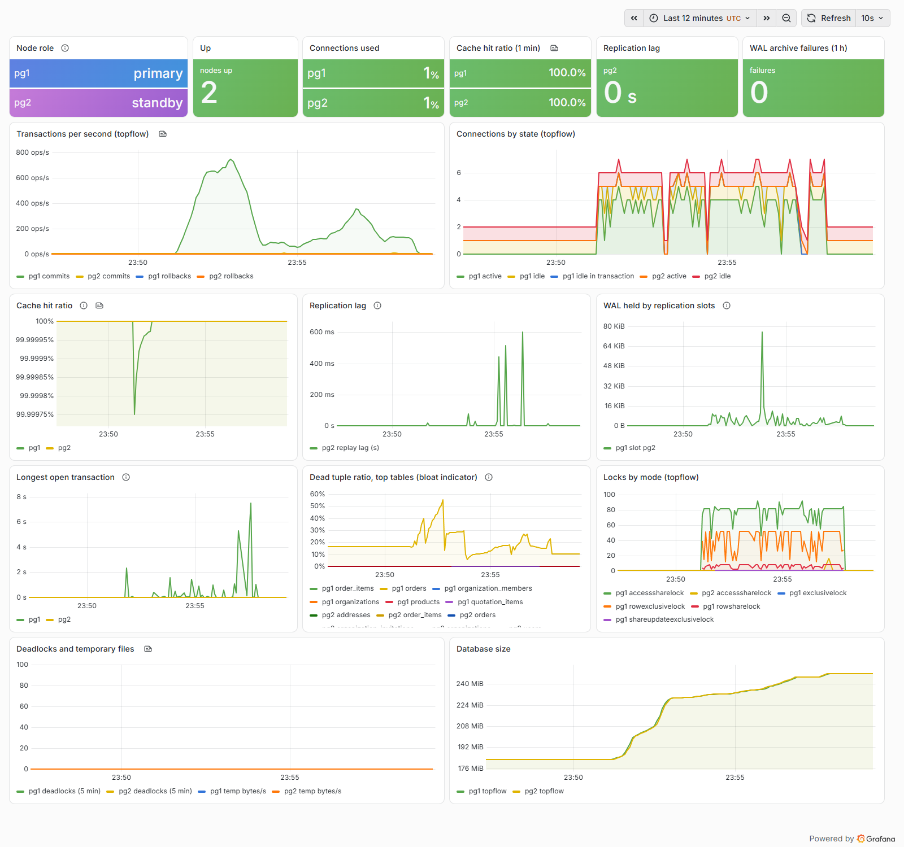

# Monitoring

Files: `monitoring/prometheus/prometheus.yml`, `monitoring/prometheus/rules/postgres.yml`,
`monitoring/prometheus/tests/postgres_test.yml`, `monitoring/grafana/`, the `exporter-*`,
`prometheus` and `grafana` services in `compose.yaml`.

```bash
./lab monitor up        # exporters, Prometheus, Grafana (images built from monitoring/)
./lab load --seconds 300
./lab monitor check     # both exporters scraped, every rule loaded, dashboard provisioned
```

Grafana: <http://127.0.0.1:55430/d/pglab-postgres> (anonymous read-only; the admin password is in
`.env`). Prometheus: <http://127.0.0.1:55490/alerts>.



The screenshot was taken with headless Chrome on 2026-09-25 while `./lab load` ran pgbench
against a SCALE=100000 data set on a laptop shared with other builds. It shows the dashboard
working; its throughput and latency values are not benchmarks.

## Collection

One postgres_exporter (v0.20.1) per node, connected as `monitor` (member of `pg_monitor`), with
the default collectors plus `stat_statements`, `long_running_transactions` and
`stat_activity_autovacuum`. Prometheus scrapes them every 5 seconds and labels each series with
`node`.

## Dashboard

| Panel | Query basis |
| --- | --- |
| Node role, up | `pg_replication_is_replica`, `pg_up` |
| Connections used, connections by state | `pg_stat_activity_count` against `pg_settings_max_connections` |
| Transactions per second | `rate(pg_stat_database_xact_commit / xact_rollback)` |
| Cache hit ratio | `blks_hit / (blks_hit + blks_read)` over one minute |
| Replication lag, WAL held by slots | `pg_replication_lag_seconds` on the standby, `pg_replication_slots_pg_wal_lsn_diff` on the primary |
| Longest open transaction | `pg_stat_activity_max_tx_duration` |
| Dead tuple ratio (bloat indicator) | `n_dead_tup / (n_live_tup + n_dead_tup)` per table |
| Locks by mode | `pg_locks_count` |
| Deadlocks and temporary files, database size | `pg_stat_database_*`, `pg_database_size_bytes` |

"Bloat" here is an indicator, not a measurement: dead tuples not yet vacuumed. Measuring the free
space inside heap and index pages needs `pgstattuple`, which is too expensive to scrape.

## Alert rules

| Alert | Fires when | Severity |
| --- | --- | --- |
| PostgresDown | the exporter cannot query a node for 1 minute | critical |
| PostgresNoWritablePrimary | no reachable node accepts writes for 1 minute | critical |
| PostgresWalArchivingFailing | `archive_command` failed in the last 10 minutes | critical |
| PostgresReplicationLagHigh | a standby's replay lag stays above 30 s for 2 minutes | warning |
| PostgresReplicationSlotInactive | a slot has no standby attached for 5 minutes | warning |
| PostgresReplicationSlotRetainsWal | a slot holds more than 2 GiB of WAL for 10 minutes | critical |
| PostgresConnectionsHigh | connections above 80% of `max_connections` for 5 minutes | warning |
| PostgresLongRunningTransaction | a transaction open for more than 5 minutes | warning |
| PostgresDeadlocks | any deadlock in 5 minutes | warning |
| PostgresLowCacheHitRatio | hit ratio below 95% under sustained reads for 15 minutes | warning |
| PostgresHighDeadTupleRatio | a table with more than 20% dead rows (and 10,000 or more) for 30 minutes | warning |

`promtool test rules` runs ten scenarios with synthetic series (in `./lab check` and CI), which
between them cover all eleven rules. One
of them caught a real mistake: `pg_replication_is_replica == 1 and pg_replication_lag_seconds > 30`
returns the left-hand value, so the alert text said the standby was "1s behind"; the rule now
puts the lag first. A unit test also checks that every metric used by the rules and the dashboard
exists in the exporter's output (names recorded from the running exporters).

What is not tested yet: a rule firing on the running stack. `./lab ci` starts the stack, runs
pgbench for 10 seconds and checks that both nodes are scraped and the rules are loaded; the rules'
`for` durations (up to 30 minutes) make a live firing test a drill of its own, for example
stopping the standby until `PostgresReplicationSlotInactive` fires.

No Alertmanager is configured: the alerts are visible in Prometheus and Grafana, and routing them
(e-mail, chat, paging) is a deployment decision.
